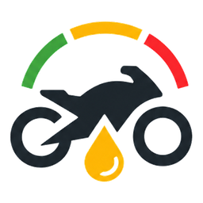

<div align="center">



# MotoCare

**Smart Motorcycle Oil Change Reminder App** — keep your engine healthy with automatic oil service tracking, status monitoring, and smart reminders.

[](https://expo.dev)
[](https://reactnative.dev)
[](https://www.typescriptlang.org)
[](LICENSE)
[](https://www.android.com)

**v1.1.0** · [`com.motocare.app`](https://github.com/MyMrshll/moto-care)

</div>

---

## 📱 Tentang MotoCare

MotoCare adalah aplikasi pengingat dan pemantau jadwal **ganti oli motor** yang dirancang untuk pengendara motor di Indonesia. Aplikasi ini menghitung kondisi oli secara otomatis berdasarkan **jarak tempuh (KM)** dan **waktu (hari)** sejak pergantian oli terakhir, lalu menampilkan status yang mudah dipahami — layaknya lampu lalu lintas.

## ✨ Fitur

| Fitur | Deskripsi |
| --- | --- |
| 🏠 **Dashboard Status** | Status oli langsung terlihat di layar utama — hijau (Aman), kuning (Peringatan), merah (Segera Ganti). |
| 🏍️ **Multi-Kendaraan** | Kelola lebih dari satu motor sekaligus dalam "Garasi". |
| 📅 **Log Ganti Oli** | Catat riwayat pergantian oli lengkap dengan tanggal & KM terakhir. |
| 🔔 **Notifikasi Otomatis** | Pengingat ketika oli mendekati batas ganti oli. |
| ⚙️ **Limit Dapat Disesuaikan** | Atur batas KM & hari secara global, atau per kendaraan. |
| 📊 **Persentase Pemakaian** | Hitungan sisa KM dan hari yang tersisa secara real-time. |

### Status Engine

MotoCare menggunakan logika perhitungan berbasis dua parameter:

| Status | Kondisi |
| --- | --- |
| 🟢 **Aman** | Di bawah 80% batas KM atau 75% batas hari. |
| 🟡 **Peringatan** | Mencapai ≥80% batas KM atau ≥75% batas hari. |
| 🔴 **Segera Ganti** | Melebihi batas KM atau batas hari. |

## 🛠️ Tech Stack

- **[Expo SDK 54](https://expo.dev)** — framework pengembangan
- **[React Native 0.81](https://reactnative.dev)** — cross-platform UI framework
- **[TypeScript 5.9](https://www.typescriptlang.org)** — type-safe development
- **[Zustand 5](https://zustand.docs.pmnd.rs)** — state management
- **[React Navigation 7](https://reactnavigation.org)** — stack & tab navigation
- **[expo-notifications](https://docs.expo.dev/versions/latest/sdk/notifications/)** — local notifications
- **[date-fns](https://date-fns.org)** — date utilities
- **[lucide-react-native](https://lucide.dev)** — icons

## 📦 Download APK

Unduh versi produksi terbaru (v1.1.0):

<a href="https://drive.google.com/file/d/1mQfdbqReWu5T5ocjyLxXPBQFvXgNrXzB/view?usp=sharing">
  
</a>

## 🚀 Memulai Pengembangan

### Prasyarat

- Node.js 20+ (disarankan via [nvm](https://github.com/nvm-sh/nvm))
- Android Studio & Android SDK (untuk build Android)
- [Expo CLI](https://docs.expo.dev/more/create-expo/)

### Instalasi

```bash
# 1. Clone repository
git clone git@github.com:MyMrshll/moto-care.git
cd moto-care

# 2. Install dependencies
npm install

# 3. Jalankan di mode development
npm start        # Expo dev server
npm run android  # Buka di emulator/perangkat Android
```

### Build APK Produksi

Build lokal dengan Gradle (direktori `android/`):

```bash
cd android
JAVA_HOME=/usr/lib/jvm/java-17-openjdk-amd64 ./gradlew assembleRelease
```

Output: `android/app/build/outputs/apk/release/app-release.apk`

> **Catatan:** Build release menggunakan debug keystore (konfigurasi default template). Untuk distribusi di Google Play, gunakan keystore produksi sendiri — lihat [Android signing docs](https://reactnative.dev/docs/signed-apk-android).

Alternatif via [EAS Build](https://docs.expo.dev/build/introduction/):

```bash
eas build --profile production --platform android
```

## 📂 Struktur Proyek

```
├── android/                # Native Android project (expo prebuild)
├── ios/                    # Native iOS project (expo prebuild)
├── src/
│   ├── components/         # Komponen UI yang dapat dipakai ulang
│   ├── navigation/         # Stack & bottom tab navigator
│   ├── screens/            # Layar-layar aplikasi
│   ├── services/           # Layanan (notifikasi, dll.)
│   ├── store/              # State management (Zustand)
│   ├── theme/              # Design system (warna, tipografi, spacing)
│   ├── types/              # TypeScript type definitions
│   └── utils/              # Core business logic (status engine)
├── assets/                 # Ikon, gambar, dan aset statis
├── .github/workflows/      # CI/CD (GitHub Actions)
├── app.json                # Konfigurasi Expo
└── package.json
```

## 🗺️ Roadmap

- [x] Manajemen kendaraan & log ganti oli
- [x] Kalkulasi otomatis status oli (KM + hari)
- [x] Notifikasi pengingat otomatis
- [x] Limit servis yang dapat disesuaikan
- [ ] iOS build & App Store release
- [ ] Export / backup data
- [ ] Dark mode
- [ ] Multi-bahasa (EN)

## 🤝 Kontribusi

Kontribusi sangat diterima! Silakan buka *issue* atau *pull request*.

1. Fork repository
2. Buat branch fitur (`git checkout -b feature/your-feature`)
3. Commit perubahan (`git commit -m 'Add some feature'`)
4. Push ke branch (`git push origin feature/your-feature`)
5. Buka Pull Request

## 📄 Lisensi

Distributed under the [GNU General Public License v3.0](LICENSE). See [COPYING](https://www.gnu.org/licenses/) for details.

> **Catatan:** GPL-3.0 bersifat *copyleft* — siapa pun yang memodifikasi dan mendistribusikan ulang kode ini **wajib** merilis source code-nya kembali dengan lisensi yang sama. Kode ini dilindungi hak cipta © 2026 **Ferta Junindi**.

---

<div align="center">

Dibuat dengan ❤️ · MotoCare 1.1.0

</div>
